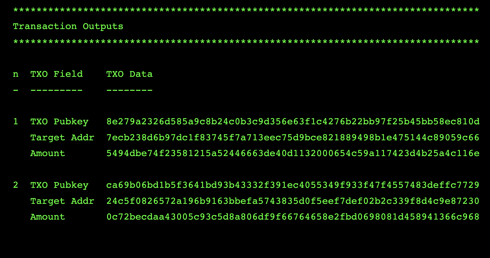

# Resolving Disputes

In some cases, when sending a transaction, the recipient will report not having received the transaction. Please use the following steps to triage and resolve disputes.

## Verify Transaction Success

First, verify whether the transaction was a success by examining the `transaction_log` for the transaction, using the [`get_transaction_logs_for_account`](../transactions/transaction-log/get_transaction_logs_for_account.md) endpoint, which will provide an example result as below:

* Note, you can filter for sent transactions using a tool such as jq, and piping the result to `| jq '.result | .transaction_log_map[] | select(. | .direction=="tx_direction_sent")'`

```
{
  "object": "transaction_log",
  "transaction_log_id": "c3e516eb1b9813041a621ee505e34ed206bae81b9553b32dbf2c94605a5cea34",
  "direction": "tx_direction_sent",
  "is_sent_recovered": null,
  "account_id": "09edc0d0392c8b4c5924187304f4dbc88729d3dd2a03832b4d30e5328bdb5fa9",
  "input_txos": [
    {
      "txo_id_hex": "abc415736c92e2736243a9d7beffca06c6e2d53d0b605c1b32661beb2685fd6a",
      "recipient_address_id": "",
      "value_pmob": "10000000000"
    }
  ],
  "output_txos": [
    {
      "txo_id_hex": "c50c2d1fbeae481e8bf68e90692f537a9d9fca62177d411d37dbb88e19a8f4d6",
      "recipient_address_id": "2Y6wPMzDkY5TijswAsymfuwJU9q4UMKuquD2hu7zaBhf4faTRpL1j1ivvbbRSWFKVTgnv2Br4dZ1Qugyaz6hjmLSD2USiSQ9vRso7H3znPeWQCdwqnCk3eQaj2sp3dZD3QknsJums5oYiVp2yhqjow2487cPY2S3qzWoCE32jZRvuG5ctWKWr5BRE7F15GzEUuubjUdGgs6LfFNBdCEXM9npUCJtu9ko3eCgeHmVg9Tv46yFMg3YvuWC3g68v6KGMnn",
      "value_pmob": "9600000000"
    }
  ],
  "change_txos": [],
  "assigned_address_id": null,
  "value_pmob": "9600000000",
  "fee_pmob": "400000000",
  "submitted_block_index": "318163",
  "finalized_block_index": "318163",
  "status": "tx_status_succeeded",
  "sent_time": "2022-03-16 06:11:02 UTC",
  "comment": "tutorial",
  "failure_code": null,
  "failure_message": null
}
```

### Confirm Status and Block Index

For a successful transaction, the `status` is `tx_status_succeeded`, and the `finalized_block_index` is populated. 

### Confirm Recipient Address

The `output_txos` for the transaction contain details about the txo itself, including the `value_pmob`, which is the amount sent in picoMOB (`MOB * 10^(-12)`). The `recipient_address_id` specifies the address to which the amount was sent.

### Confirm with the Block Explorer

You can use the `txo_id_hex` from the `output_txos` to get more information about the specific txo over which there may be a dispute, with the [`get_txo`](../transactions/txo/get_txo.md) endpoint.

```
$ curl -s localhost:9090/wallet -d '{"method": "get_txo", "params": {"txo_id": "c50c2d1fbeae481e8bf68e90692f537a9d9fca62177d411d37dbb88e19a8f4d6"}, "jsonrpc": "2.0", "id": 1}' -X POST -H 'Content-type: application/json'  | jq

{
  "method": "get_txo",
  "result": {
    "txo": {
      "object": "txo",
      "txo_id_hex": "c50c2d1fbeae481e8bf68e90692f537a9d9fca62177d411d37dbb88e19a8f4d6",
      "value_pmob": "9600000000",
      "recipient_address_id": null,
      "received_block_index": null,
      "spent_block_index": null,
      "is_spent_recovered": false,
      "received_account_id": null,
      "minted_account_id": "09edc0d0392c8b4c5924187304f4dbc88729d3dd2a03832b4d30e5328bdb5fa9",
      "account_status_map": {
        "09edc0d0392c8b4c5924187304f4dbc88729d3dd2a03832b4d30e5328bdb5fa9": {
          "txo_type": "txo_type_minted",
          "txo_status": "txo_status_secreted"
        }
      },
      "target_key": "0a207ecb238d6b97dc1f83745f7a713eec75d9bce821889498b1e475144c89059c66",
      "public_key": "0a208e279a2326d585a9c8b24c0b3c9d356e63f1c4276b22bb97f25b45bb58ec810d",
      "e_fog_hint": "0a5497815c16a0ed7cc0b40eb3f0d3b4f6e9c2d14455495f971c2eff3e53889ee50e48a0ceede2c502499a4a1f181a8be0e9c0347d1a21923510c86ac102a400b5b5dd4ce8b145ab754f6541d610957857f983cb0100",
      "subaddress_index": null,
      "assigned_address": null,
      "key_image": null,
      "confirmation": "0a209d298c11da7d6f3798c7ddef69aea407170cc8f917c5cbfb4e8651513995db31"
    }
  },
  "jsonrpc": "2.0",
  "id": 1
}
```

You can use the `public_key` to confirm with the block explorer. The MobileCoin Foundation hosts a public block explorer at [https://block-explorer.mobilecoin.foundation/](https://block-explorer.mobilecoin.foundation/). 

For the example above, we can go to the block index indicated in the `transaction_log`: `318163`, here: [https://block-explorer.mobilecoin.foundation/block/318163](https://block-explorer.mobilecoin.foundation/block/318163), and scroll down to the Transaction Outputs section, where we see the public key `8e279a2326d585a9c8b24c0b3c9d356e63f1c4276b22bb97f25b45bb58ec810d` (with the prefix `0a20` removed)




## Provide Confirmation Receipt to the Receiver

After you have confirmed that the `transaction_log` indicates that you sent the transaction to the correct recipient, and you confirmed that the transaction outputs are in the blockchain, the next step of dispute resolution involves providing a cryptographic proof that you created the transaction, called a *confirmation*. You can follow the steps below to create a confirmation:

### Sender Provides the TXO Confirmations

1. Using the `transaction_log_id` obtained from the previous step, call [`get_confirmations`](../transactions/transaction-confirmation/get_confirmations.md)

2. This will return a response that has an array of confirmations. In most cases, there will only be 1, but if you created a multi-output transaction there will be more.

```
$ curl -s localhost:9090/wallet -d '{"method": "get_confirmations", "params": {"account_id": "09edc0d0392c8b4c5924187304f4dbc88729d3dd2a03832b4d30e5328bdb5fa9", "transaction_log_id": "c3e516eb1b9813041a621ee505e34ed206bae81b9553b32dbf2c94605a5cea34"}, "jsonrpc": "2.0", "api_version": "2", "id": 1}' | jq

{
  "method": "get_confirmations",
  "result": {
    "confirmations": [
      {
        "object": "confirmation",
        "txo_id_hex": "c50c2d1fbeae481e8bf68e90692f537a9d9fca62177d411d37dbb88e19a8f4d6",
        "txo_index": "949838",
        "confirmation": "0a209d298c11da7d6f3798c7ddef69aea407170cc8f917c5cbfb4e8651513995db31"
      }
    ]
  },
  "jsonrpc": "2.0",
  "id": 1
}
```

3. For the TXO that you wish to confirm, this is where you would send the recipient the txo_id and confirmation pairing for each txo you wish to have them validate.

### Receiver Validates the TXO Confirmation

1. For each of the txo_id and confirmation pairings generated in the previous step, call [`validate_confirmation`](../transactions/transaction-confirmation/validate_confirmation.md) using the `account_id` of `account_b`, which is the receiving account.

If all is successful, you should have gotten a response with a result of `"validated": true`