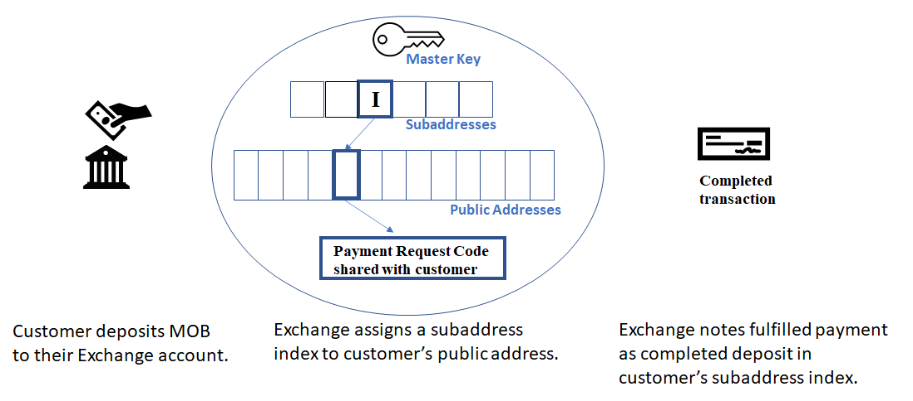

# Subaddress

MobileCoin implements cryptonote-style subaddresses to allow funds to be received at a range of indexed public addresses, all under the control of one set of private keys. Subaddresses allow an Exchange to track account balances efficiently for a large number of users because a single cryptographic operation can identify incoming transactions for the entire set of Exchange users associated with the account’s Master Key.

In addition, Exchanges can manage their account’s subaddresses in order to track information about deposits from users and associate specific transactions with the user that sent the deposit.

<figure><figcaption></figcaption></figure>

When an Exchange customer wants to send MOB to the Exchange (e.g. the customer wishes to deposit funds to their account at the Exchange), the Exchange assigns a monitored subaddress index to this customer and shares a Payment Request code created using the public address corresponding to the customer’s assigned subaddress index.


It is the Exchange’s responsibility to manage their subaddresses in a way that allows transactions to be associated with the user that sent them.


The Exchange then shares the Payment Request code with the customer. When the customer fulfills the Payment Request to complete the deposit, the Exchange observes the incoming payment in the ledger at the assigned subaddress index. The payment is then reflected in the balance of the subaddress assigned to the customer.


Subaddresses are not intended to be used to track a users balance, but more so as a “revolving door” of incoming payments. When sending a transaction to someone, txos are selected from the entire account’s available unspent txos.

